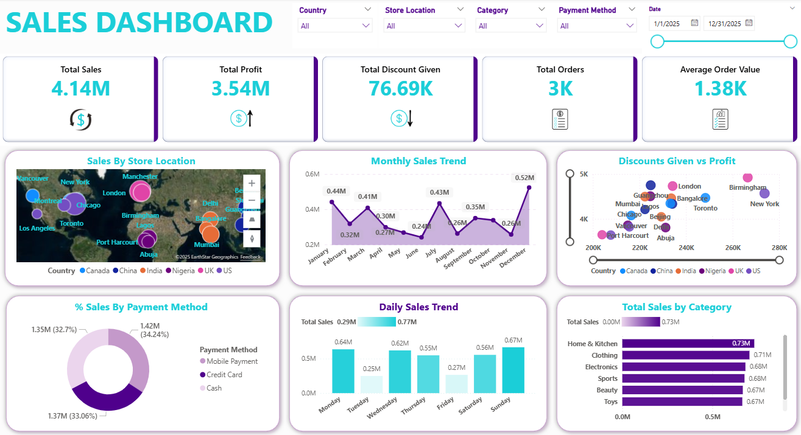

# 🌍 Global Sales Data ETL & Feature Engineering Project

## 💡 Overview
This project involved the **Extract, Transform, and Load (ETL)** process and **Feature Engineering** on raw, fragmented sales data. The core challenge was to consolidate records from six different countries (Canada, China, India, Nigeria, UK, US) into a single, clean analytical dataset, ensuring data integrity and preparing it for comprehensive reporting. The final dataset served as the source for building a robust Sales Performance Dashboard.

## 🛠️ Technology Stack
* **Database:** PostgreSQL (for data storage, cleaning, and transformation)
* **Language:** SQL (for ETL and Feature Engineering)
* **Visualization:** Power BI (for creating the final dashboard)

## 📊 Project Steps & Key Transformations

The entire data preparation workflow, from integration to enrichment, was documented and executed using a single, versioned SQL script.

### 1. Data Integration (UNION ALL)
* **Action:** Utilized the **`UNION ALL`** clause to efficiently combine individual sales tables from all six source countries into one unified master table named `Sales Data`.
* **Result:** Successfully consolidated a total of 3002 transactional records into a single source of truth.

### 2. Data Cleaning & Strategic Imputation
A critical decision was made to **preserve the dataset size** by performing **imputation** rather than deleting rows with missing values (`NULL`).
* **Action:** Used **`UPDATE`** statements in SQL to locate missing data (`WHERE [Column] IS NULL`).

* **Imputation Logic:** Missing values were handled using two strategic methods:
    * **Quantity Purchased:** Missing data was imputed with a **subjective placeholder value (3)**, based on a business judgment call.
    * **Price Per Unit:** Missing data was imputed using the **Average (AVG)** value of the entire column. This statistical method ensures minimal distortion of the dataset's central tendency.

### 3. Feature Engineering
This was the primary data enrichment step, where two essential analytical metrics were calculated and added to the dataset:

| Column Name | Calculation (SQL Logic) | Purpose |
| :--- | :--- | :--- |
| **Total Amount** | `("Price Per Unit" * "Quantity Purchased") - "Discount Applied"` | Calculates the final revenue generated per transaction after accounting for volume and discounts. |
| **Profit** | `"Total Amount" - ("Cost Price" * "Quantity Purchased")` | Determines the net profit per transaction, crucial for financial profitability analysis. |

## 📁 Repository Structure
* **`01_Source_Data/`**: Contains the original, raw sales files and data preparation files.
* **`02_SQL_Scripts/`**: Contains the full ETL and Feature Engineering script: `01_Sales_Data_ETL_and_Feature_Engineering.sql`. **(This documents the entire transformation process.)**
* **`03_Final_Dataset/`**: Contains the final, cleaned, and enriched dataset ready for visualization: `sales_Data.csv`.
* **`04_PowerBI_Dashboard/`**: Contains the final visualization dashboard and dashboard overview screenshot.

## 🎯 Key Findings from the Dashboard
1.  **Exceptional Profitability and Margin:** Total Profit ($3.54M) is nearly identical to Total Sales ($4.14M). This suggests either excellent cost control or a potential data anomaly that requires investigation (e.g., if the Cost Price data is incomplete). Regardless, the current data indicates strong financial health.
2.  **Daily Sales Dependency:** Sales volume peaks during the weekend (Saturday) and at the start of the week (Monday), indicating customer activity outside of the traditional 9-to-5 workday.Minimal Activity: Sales hit their lowest point on Thursday (0.25M) and Friday (0.27M), which suggests a significant drop-off in purchasing toward the end of the traditional work week. Strategic Implication: This trend suggests that operational resources or marketing efforts might be misaligned with actual customer demand patterns.
3.  **Balanced Category Contribution:** The top three categories are closely grouped: Home & Kitchen ($0.73M), Clothing ($0.71M), and Electronics ($0.68M). The revenue streams are well-diversified across key product categories, indicating low business risk exposure to any single segment. Home & Kitchen currently leads, but all three categories should be treated as primary growth drivers.

## 📈 Final Sales Performance Dashboard

**Objective:** To provide executive insights by visualizing key performance indicators (KPIs) such as Total Revenue, Total Profit, and Sales Trends across regions and product categories.

---

### Global Sales and Profitability Overview
 
_A screenshot of the final interactive dashboard, built in Microsoft Power BI. This visualization is powered by the cleaned and engineered dataset._
